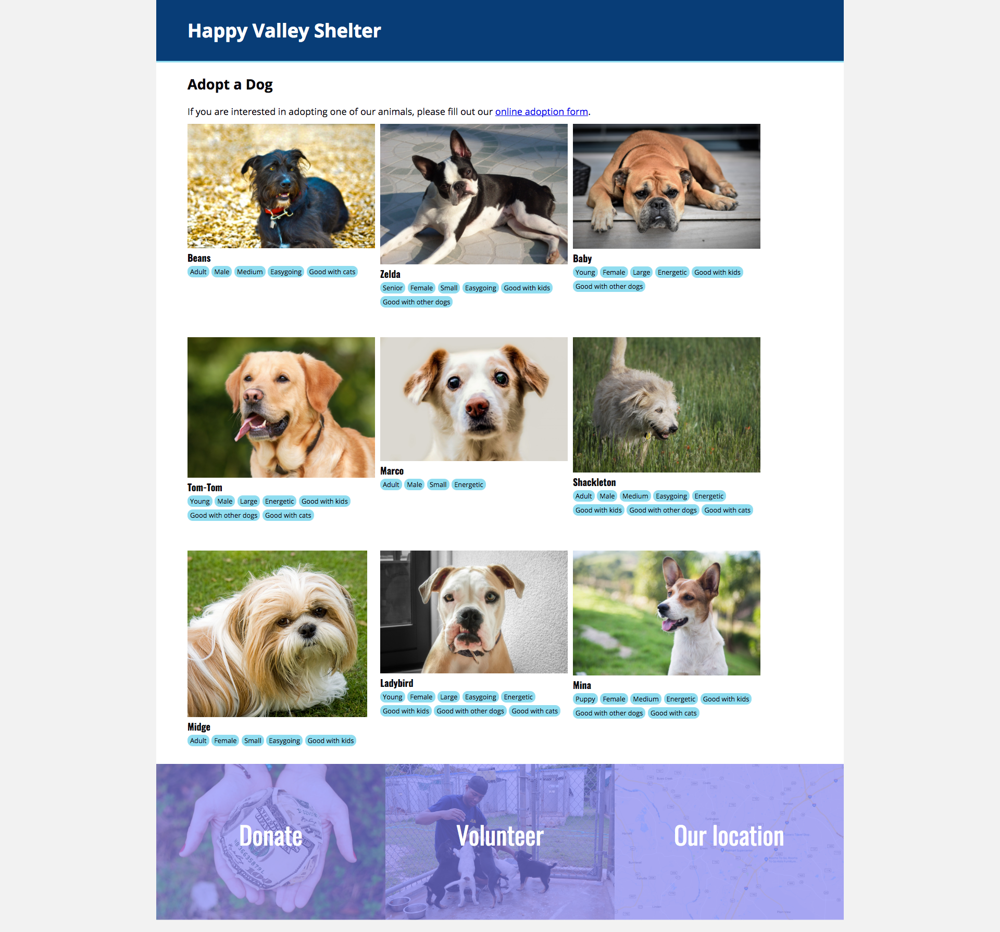

# Build a Dog Adoption Site

## Directions

Your task is to build one page for an animal shelter. You will need to build the HTML and CSS to make this page. The page should look like the following:



The fonts used are Open Sans and Oswald, and can be included by adding the following line to your document's `<head>` before your own CSS:

```html
<link href="https://fonts.googleapis.com/css?family=Open+Sans:400,700|Oswald:400,700" rel="stylesheet">
```

The link to the adoption application form should go to `#`, which is a way to link to the same page as you are currently on.
